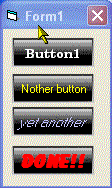

## BLACK BEAUTY \(button\)   This button is a imitation of a flash button \(screenshot\)

### Description

This is a flash button simulation in that when the mouse enters the button the caption flashes several times. In terms of the actual number of lines of code needed for this button it is quite thrifty which should mean a totally error free and processor easy button. I call it black beauty. Once again feedback to motivate me for improvement is highly desired.
 
### More Info
 

             |
---                |---
**Submitted On**   |2005-02-15 22:59:02
**By**             |[Evan Toder](https://github.com/Planet-Source-Code/PSCIndex/blob/master/ByAuthor/evan-toder.md)
**Level**          |Intermediate
**User Rating**    |4.5 (27 globes from 6 users)
**Compatibility**  |VB 3\.0, VB 4\.0 \(16\-bit\), VB 4\.0 \(32\-bit\), VB 5\.0, VB 6\.0
**Category**       |[Custom Controls/ Forms/  Menus](https://github.com/Planet-Source-Code/PSCIndex/blob/master/ByCategory/custom-controls-forms-menus__1-4.md)
**World**          |[Visual Basic](https://github.com/Planet-Source-Code/PSCIndex/blob/master/ByWorld/visual-basic.md)
**Archive File**   |[BLACK\_BEAU1853432152005\.zip](https://github.com/Planet-Source-Code/evan-toder-black-beauty-button-this-button-is-a-imitation-of-a-flash-button-screenshot__1-58935/archive/master.zip)

